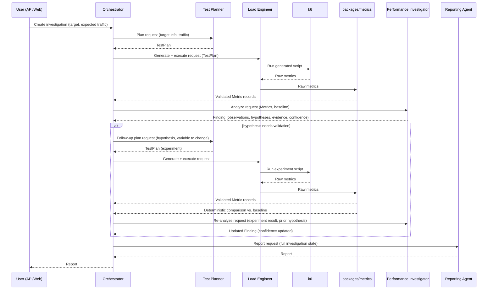

# Data Flow — The Investigation Loop

## Lifecycle

```text
UNDERSTAND → PLAN → GENERATE → EXECUTE → OBSERVE → INVESTIGATE → EXPERIMENT → COMPARE → REPORT
```

- **UNDERSTAND** — ingest target info: API spec / user journeys / expected traffic (human-provided, Test Planner formats it).
- **PLAN** — Test Planner produces a structured `TestPlan`.
- **GENERATE** — Load Engineer turns the `TestPlan` into a k6 script.
- **EXECUTE** — Load Engineer runs the script (via Celery, off the request path) against the confirmed target.
- **OBSERVE** — `packages/metrics` parses raw k6 output into validated `Metric` records.
- **INVESTIGATE** — Performance Investigator turns metrics into observations, hypotheses, evidence, confidence.
- **EXPERIMENT** — if a hypothesis needs validation, the Orchestrator asks the Test Planner for a follow-up plan (e.g. same journey, different DB pool size) and loops back to GENERATE.
- **COMPARE** — `packages/metrics` deterministically diffs the experiment's results against the baseline (this is a calculation, not an AI judgment — see below).
- **REPORT** — once the Orchestrator decides the investigation is sufficient, the Reporting Agent turns the full investigation into a human-readable report.

## Sequence diagram (single test → investigation → follow-up experiment)



## Worked example (see also docs/demo-scenario.md)

```text
500 users   → Investigator: healthy
750 users   → Investigator: "p95 rose 420ms → 2.8s — anomaly detected"
            → Hypothesis: DB connection contention (evidence: pool at 98% utilization)
            → Recommended experiment: repeat at 750 users with pool size doubled
Experiment  → Orchestrator asks Test Planner for that follow-up plan
            → Load Engineer executes it
            → packages/metrics computes: p95 improved 42% vs. the 750-user baseline
            → Investigator: hypothesis confidence increases (e.g. 60% → 87%)
Reporting Agent → capacity estimate, ranked findings, recommendations
```

## Investigation state

The Orchestrator owns exactly one `InvestigationState` object per investigation. Agents never see more of it than their task requires — the Orchestrator projects the relevant slice out before calling a specialist. Full field-level type: `packages/schemas/python/agent_io.py::InvestigationState`.

```json
{
  "investigation_id": "inv_01HXYZ...",
  "target_id": "tgt_01HXYZ...",
  "status": "investigating",
  "baseline_test_run_id": "run_01HXYZ...",
  "current_test_run_id": "run_01HXYZ...",
  "observations": [
    { "id": "obs_1", "test_run_id": "run_01H...", "summary": "p95 rose from 420ms to 2.8s between 500 and 750 VUs" }
  ],
  "findings": [
    { "id": "find_1", "severity": "HIGH", "summary": "Latency degradation beginning ~750 concurrent users" }
  ],
  "hypotheses": [
    { "id": "hyp_1", "finding_id": "find_1", "statement": "Database connection pool contention", "confidence": 0.6, "status": "testing" }
  ],
  "experiments": [
    { "id": "exp_1", "hypothesis_id": "hyp_1", "variable_changed": "db_pool_size", "from": 50, "to": 100, "test_run_id": "run_02H..." }
  ],
  "decisions": [
    { "step": "investigate", "decision": "hypothesis hyp_1 needs an experiment before it can be reported", "made_by": "orchestrator" }
  ]
}
```

Rules:

- Only the Orchestrator writes to this object. Specialists return structured results; the Orchestrator merges them in.
- Every specialist call is logged as an `AIExecution` referencing the state snapshot it was given and the output it returned (see [database design](../database/database-design.md)), so the whole loop is reconstructable after the fact.
- `status` transitions (`planning → running → investigating → experimenting → reporting → complete`) are decided by the Orchestrator using explicit rules (e.g. "a HIGH/CRITICAL finding with confidence < 0.8 and an unexecuted recommended experiment ⇒ run one more experiment before reporting"), not by asking an LLM "are we done yet?" in free text. The rules themselves may consult an AI recommendation (the Investigator's `recommended_experiments`), but the loop-continues/loop-stops decision is deterministic Orchestrator logic against the state, so the investigation always terminates instead of looping indefinitely. A hard cap (e.g. max 3 follow-up experiments per investigation, configurable) is enforced regardless of AI confidence.

## Where the loop can legitimately stop early

- No anomaly detected relative to thresholds — go straight to Reporting.
- Confidence already high enough for the top finding (default threshold: 0.8, matching the demo scenario's 87% example) — no further experiment needed.
- Experiment budget exhausted — report with whatever confidence was reached, and say so explicitly in the report rather than implying certainty.
