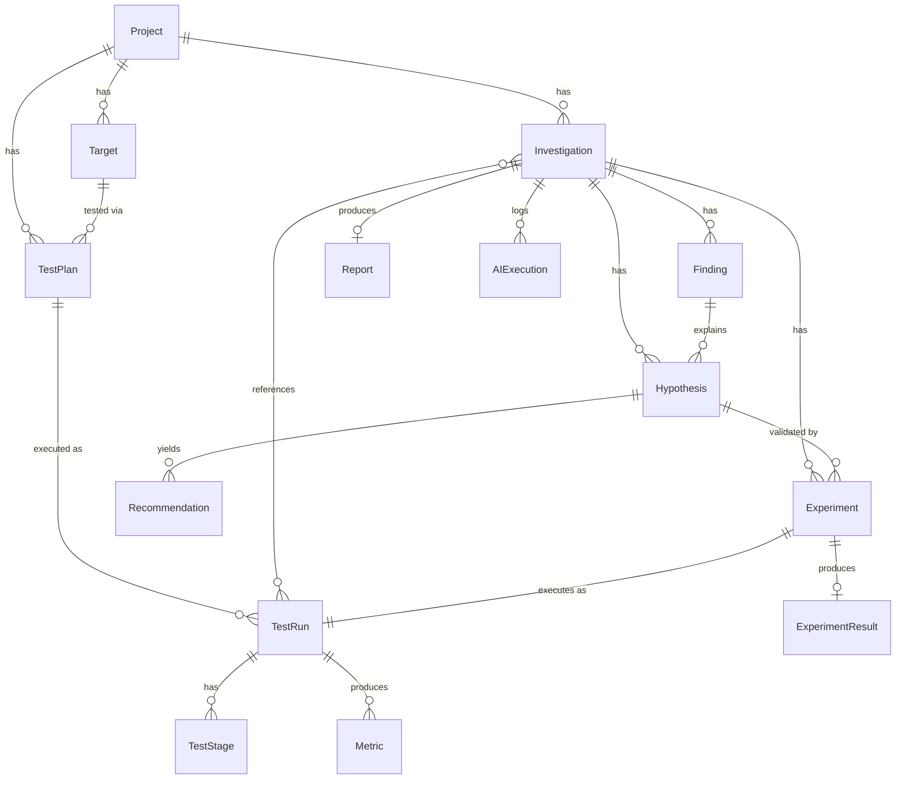

# Database Design

**Owner:** Developer 3 (Backend / Data) · **Engine:** PostgreSQL (see [ADR-001](../decisions/ADR-001-tech-stack.md))

This document defines entities and relationships. **No migrations are implemented in Phase 0** — this is the agreed shape Developer 3 will implement as Alembic (or equivalent) migrations in Phase 1.

## Entity-relationship overview



```text
Project
   │
   ├── Targets
   │
   ├── TestPlans
   │      │
   │      └── TestRuns
   │             │
   │             ├── TestStages
   │             └── Metrics
   │
   └── Investigations
          │
          ├── Findings ── Hypotheses ── Experiments ── ExperimentResults
          │                    │
          │                    └── Recommendations
          ├── Report
          └── AIExecutions (audit log of every agent call made during this investigation)
```

## Entities

All entities use a `UUID` primary key (`id`) unless noted, plus `created_at`/`updated_at` timestamps. IDs elsewhere in this doc set are written with a short prefix for readability (`run_...`, `inv_...`); the prefix is a display/logging convention, not a schema requirement.

### Project
- `id`, `name`, `description`
- Top-level container. A project belongs to one team/user in the MVP (no multi-tenant sharing model yet — see [security model](../security/security-model.md)).

### Target
- `id`, `project_id` (FK), `base_url`, `name`
- `authorization_confirmed: bool`, `authorization_confirmed_by`, `authorization_confirmed_at`
- A `Target` cannot be used in a `TestRun` unless `authorization_confirmed = true` and `base_url`'s host is on the configured allow-list at execution time (checked twice: at `Target` creation and again immediately before k6 execution).

### TestPlan
- `id`, `project_id` (FK), `target_id` (FK)
- `test_type` (enum: load/stress/spike/endurance/capacity/baseline/regression), `rationale`
- `target_concurrency`, `ramp_strategy` (JSONB), `user_journeys` (JSONB), `thresholds` (JSONB), `duration` (JSONB), `stages` (JSONB), `success_criteria` (JSONB)
- `controlled_variable` (JSONB, nullable) — set only for experiment plans (see [test-planner.md](../agents/test-planner.md))
- `status`: `proposed | approved | superseded`
- **Why JSONB for `ramp_strategy`/`stages`/etc.:** these fields have a documented shape (see [test-planner.md](../agents/test-planner.md#output-schema)) but no query needs to filter *inside* them in the MVP — they're read back whole by the Load Engineer and the dashboard. JSONB avoids a churny table-per-field-shape migration cycle while the plan schema is still stabilizing. If a field needs indexed querying later (e.g. "find all plans with `test_type = stress`"), `test_type` itself is already a normal column for exactly that reason.

### TestRun
- `id`, `test_plan_id` (FK), `target_id` (FK)
- `status`: `queued | running | succeeded | failed | aborted_over_limit`
- `k6_script_ref` (pointer to stored script — see `infrastructure/docker`), `raw_output_ref` (pointer to stored raw k6 summary)
- `clamped` (JSONB, nullable) — set if executed VUs/duration were reduced from the plan's request
- `started_at`, `completed_at`

### TestStage
- `id`, `test_run_id` (FK), `target_vus`, `duration_s`, `sequence_index`
- Denormalized from `TestPlan.stages` at execution time so a run's *actual* stage progression (including any clamping) is recorded independently of what was planned.

### Metric
- `id`, `test_run_id` (FK), `endpoint` (nullable — null means "aggregate across the whole run")
- `p50_ms`, `p90_ms`, `p95_ms`, `p99_ms`, `throughput_rps`, `error_rate`, `concurrency`, `http_status_distribution` (JSONB)
- `recorded_at` (for time-bucketed metrics within a single long-running test, if collected at intervals rather than just as a final summary)
- Produced exclusively by `packages/metrics` parsing k6 output — never written by an agent directly (see [system-architecture.md#ai-output-reliability](../architecture/system-architecture.md)).

### Investigation
- `id`, `project_id` (FK), `target_id` (FK)
- `objective`: `determine_capacity | diagnose_regression | validate_fix | baseline`
- `status`: `planning | running | investigating | experimenting | reporting | complete | failed`
- `baseline_test_run_id` (FK, nullable), `current_test_run_id` (FK, nullable)
- `experiments_run: int` (for enforcing `MAX_EXPERIMENTS_PER_INVESTIGATION`, see [orchestrator.md](../agents/orchestrator.md))

### Finding
- `id`, `investigation_id` (FK), `severity` (enum: CRITICAL/HIGH/MEDIUM/LOW/INFO), `summary`
- `observations` (JSONB — list of `{ statement, metric_ref }`, see [performance-investigator.md](../agents/performance-investigator.md))

### Hypothesis
- `id`, `finding_id` (FK), `statement`, `confidence: float (0-1)`, `status`: `proposed | testing | supported | rejected`
- `evidence` (JSONB — list of `{ statement, source_ref }`)
- `recommended_experiment` (JSONB, nullable)

### Experiment
- `id`, `hypothesis_id` (FK), `test_plan_id` (FK), `test_run_id` (FK)
- `variable_changed`, `baseline_value`, `experiment_value`

### ExperimentResult
- `id`, `experiment_id` (FK)
- `comparison` (JSONB — the deterministic diff from `packages/metrics`: `p95_delta_ms`, `p95_delta_pct`, etc.)
- `conclusion`: `hypothesis_supported | hypothesis_rejected | inconclusive`

### Recommendation
- `id`, `hypothesis_id` (FK), `statement`, `priority` (enum matching Finding severity)

### Report
- `id`, `investigation_id` (FK, unique — one report per investigation in the MVP; re-generating supersedes rather than duplicating)
- `executive_summary`, `capacity` (JSONB), `key_metrics` (JSONB), `bottleneck_analysis` (JSONB), `regression` (JSONB)

### AIExecution
- `id`, `investigation_id` (FK, nullable — some calls, like ad hoc script generation, may not yet belong to an investigation)
- `test_run_id` (FK, nullable), `agent` (enum: orchestrator/test_planner/load_engineer/performance_investigator/reporting), `timestamp`
- `input_reference` (pointer to the stored request payload), `output_reference` (pointer to the stored response payload)
- `decision` (free text — for the Orchestrator, what it decided and why; for specialists, a one-line summary)
- `provider`, `model` (which `AIService` provider/model actually served this call — see [ADR-004](../decisions/ADR-004-ai-provider-abstraction.md))
- This is the full observability trail described in [system-architecture.md](../architecture/system-architecture.md#observability). Every field an agent output cites should be traceable back through this table.

## Indexing notes (documented now, applied when migrations are written)

- `Target(project_id)`, `TestPlan(target_id)`, `TestRun(test_plan_id)`, `Metric(test_run_id)`, `Finding(investigation_id)`, `Hypothesis(finding_id)`, `AIExecution(investigation_id)` — standard FK indexes for the dashboard's primary read paths.
- `TestRun(status)` and `Investigation(status)` — partial indexes on `running`/`queued` for the worker polling / progress views.
- `Metric` is the highest-volume table if interval-based (not just summary) metrics are collected. If demo/hackathon volume outgrows plain Postgres, the documented escalation path is a Timescale/hypertable extension on `Metric` alone — not a wholesale database change (see [Scalability note](#scalability-note)).

## Scalability note (documented decision, not implemented)

PostgreSQL is sufficient for the hackathon's data volume (a handful of investigations, each with a bounded number of test runs and interval metrics). If PerfPilot needs to retain high-cardinality, high-frequency time-series metrics at production scale, the intended next step is a Timescale hypertable on `Metric` rather than switching database engines — this is deferred because it's unnecessary complexity for the MVP (see [ADR-001](../decisions/ADR-001-tech-stack.md)).
