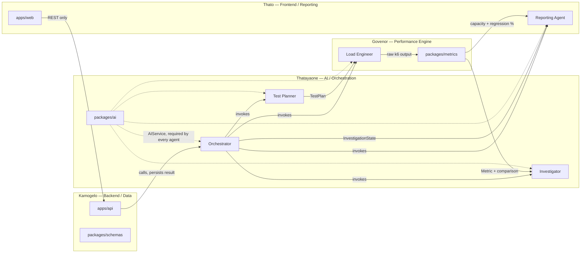

# Team Workflow & Ownership

Four developers, four largely independent surfaces. The split is designed so each person can build against the contracts in `packages/schemas` and `docs/` without waiting on another developer's in-progress code.

## Ownership map

| Developer | Owns | Responsibilities |
|---|---|---|
| **Developer 1/Thatayaone — AI / Orchestration** | `agents/orchestrator/`, `agents/test-planner/`, `agents/performance-investigator/`, `packages/ai/` | Orchestrator state machine and continuation policy; agent contracts; AI provider abstraction; prompts; structured-output validation for all four specialist agents' schemas |
| **Developer 2/Govenor — Performance Engine** | `agents/load-engineer/`, `packages/metrics/`, `infrastructure/docker/k6/` | k6 script generation; execution wrapper; safety-ceiling enforcement; raw-metric parsing; all deterministic metric/threshold/regression calculations |
| **Developer 3/Kamogelo — Backend / Data** | `apps/api/`, database migrations, `packages/schemas/` | FastAPI endpoints; auth; persistence; background job wiring (Celery); owns the canonical schema definitions everyone else builds against |
| **Developer 4/Thato — Frontend / Reporting** | `apps/web/`, `agents/reporting/` | Dashboard; charts; live test/investigation progress views; the Reporting Agent (report synthesis is presentation-adjacent, and pairs naturally with the person building the report's UI) |

## Who depends on whom

Ownership tells you which files are yours. It doesn't tell you whose work blocks yours, or whose contract you're consuming. This section makes that explicit — most of these dependencies are already "soft" (buildable against a fixture or a stub, per [roadmap.md](../roadmap.md#phase-1--thin-vertical-slice)), but you still need to know whose schema you're building against so you know who to ask when it needs to change.



Solid arrows are data-flow dependencies (A's output is B's input); dashed arrows are the shared `packages/ai` dependency every agent has. Per [agent-architecture.md](../architecture/agent-architecture.md), no agent calls another agent directly — every solid arrow between two agents is actually mediated by the Orchestrator, but the schema dependency is still real: whoever owns the consuming agent depends on the schema the producing agent's owner defines.

| Who | Depends on | For | Blocking? |
|---|---|---|---|
| Govenor (Load Engineer) | Thatayaone (Test Planner) | `TestPlan` — Load Engineer's input schema | No — build against a fixture `TestPlan` first, per [roadmap.md](../roadmap.md) |
| Thatayaone (Investigator) | Govenor (`packages/metrics`) | Computed `Metric` records and the deterministic comparison diff | No — build against fixture metrics first |
| Thato (Reporting Agent) | Thatayaone (Orchestrator) | The assembled `InvestigationState` — the one agent allowed the full state | No — build against a fixture `InvestigationState` first |
| Thato (Reporting Agent) | Govenor (`packages/metrics`) | Capacity estimate and regression % — computed once, never recomputed by the agent | No — same fixture covers it |
| Kamogelo (`apps/api`) | Thatayaone (Orchestrator) | Every domain decision — the API calls it and persists what comes back | No — stub the Orchestrator's response shape |
| Thato (`apps/web`) | Kamogelo (`apps/api`) | Everything the dashboard shows, including live `TestRun`/`Metric` views | No — build against a mocked API |
| Everyone (every agent) | Thatayaone (`packages/ai`) | `AIService` — the only sanctioned path to an LLM call, per [ADR-004](../decisions/ADR-004-ai-provider-abstraction.md) | **Yes, at the code level** — it's a required import, not a fixture-able boundary. `packages/ai` should be the first thing Thatayaone ships. |
| Everyone (every schema consumer) | Kamogelo (`packages/schemas`, canonical file location) | The file lives here, but sign-off on an *agent's own* input/output schema shape comes from that agent's owner, not automatically from Kamogelo — see [Shared / jointly-owned paths](#shared--jointly-owned-paths) below | Contract-change only |
| Govenor ↔ Kamogelo | each other (`infrastructure/docker/`) | Govenor owns the `k6-runner` container; Kamogelo owns the overall `docker-compose.yml` wiring it into | Mutual — flag changes before merging |
| Govenor ↔ Thato | each other (no owner yet — [open question](../roadmap.md#open-questions-to-revisit-not-blocking-phase-1)) | Whether `Metric` needs interval/time-bucketed rows for the dashboard's live progress view, or summary-at-completion is enough | Settle early — a wrong guess here means one of you reworks a shape mid-Phase-1 |

### A gap we found and closed during architecture review

The original four-way split (orchestrator+planner / load-engineer / backend / frontend+reporting) didn't assign an owner to `agents/performance-investigator/`. Since it's the most reasoning-heavy, prompt-and-validation-heavy agent in the system — the same skill set as the orchestrator and test planner — it's assigned to **Developer 1/Thatayaone** rather than split off on its own or bolted onto a less-related surface. This does mean Developer 1/Thatayaone owns three agent folders instead of one or two; that's an accepted trade-off given `apps/web` is already a large surface for Developer 4/Thato on its own, and the three agents Developer 1/Thatayaone owns share the same underlying skill (structured-output prompting against `packages/ai`) rather than being three unrelated problems.

### Shared / jointly-owned paths

Not everything has exactly one owner. These require lightweight coordination (see [CONTRIBUTING.md](../../CONTRIBUTING.md#shared-paths--get-a-second-opinion-before-merging)):

- **`packages/schemas/`** — formally owned by Developer 3/Kamogelo (it's the backend's canonical contract layer), but every developer proposes changes to the slice they consume. No one edits another agent's input/output schema without that agent's owner signing off.
- **`packages/common/`** — cross-cutting utilities with no single owner; changes go through PR review from at least one other developer regardless of who wrote the diff.
- **`docs/`** — each doc is closest-owned by whoever owns the corresponding code (`docs/agents/orchestrator.md` → Developer 1/Thatayaone, `docs/api/api-contract.md` → Developer 3/Kamogelo, etc.), but architecture-level docs and ADRs are a team decision, proposed by whoever identifies the need and agreed by the group before merging.
- **Root config** (`docker-compose.yml` once it exists, CI config, `.env.example`) — touches everyone's local setup; flag changes before merging, per [CONTRIBUTING.md](../../CONTRIBUTING.md).

## Git workflow

```text
main
  │
  └── develop
        │
        ├── feature/orchestrator
        ├── feature/k6-engine
        ├── feature/backend
        └── feature/dashboard
```

- `main` — always demo-ready. Only receives merges from `develop`.
- `develop` — integration branch. All feature work merges here first.
- `feature/*`, `fix/*`, `docs/*` — branch per unit of work, never work directly on `main` or `develop`.

See [CONTRIBUTING.md](../../CONTRIBUTING.md) for commit message conventions, PR review expectations, and the process for changing a shared contract.

## How the contracts enable parallel work

Once this Phase 0 documentation is agreed:

- Developer 3/Kamogelo can build every `apps/api` endpoint against `packages/schemas` with the Orchestrator stubbed to return canned responses matching its documented output schema.
- Developer 1/Thatayaone can build and test each agent in isolation against its own input/output schema, using fixture inputs, without a working API or frontend.
- Developer 2/Govenor can build k6 generation and the metrics pipeline against a fixture `TestPlan` and recorded k6 output, without waiting on the Test Planner or Investigator to exist.
- Developer 4/Thato can build the dashboard against a mocked API returning fixture `InvestigationState`/`Report` payloads, and build the Reporting Agent against fixture `InvestigationState` input, without waiting on a real investigation ever having run.

This is the entire point of freezing `packages/schemas` and `docs/agents/*.md` before implementation starts — see [CONTRIBUTING.md](../../CONTRIBUTING.md#before-you-write-code).

## Communication

For a hackathon-length project: a short daily sync (even 10 minutes) covering (1) anything you changed in a shared path, (2) any contract you need changed, (3) anything blocking you on another owner's surface, is enough to keep four people from drifting out of sync — no heavier process than that is needed at this scale.
